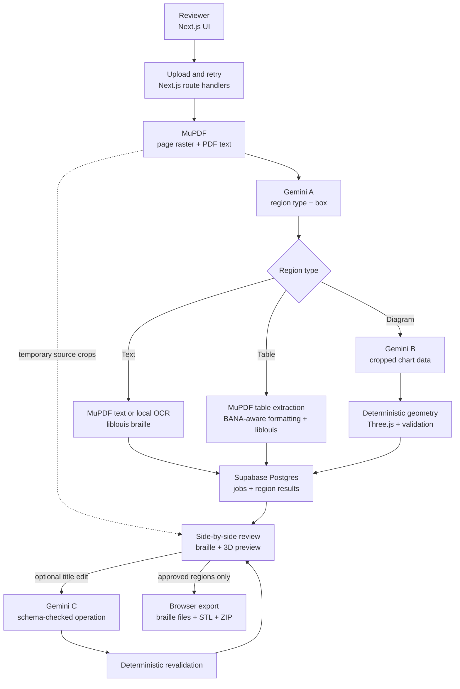

# Emboss

**Accessible books and worksheets should not make blind students wait.**

Emboss turns 1–3 pages of a PDF into a reviewable package of braille text, braille-formatted tables, and 3D-printable tactile charts. A teacher, publisher, or volunteer can prepare the files together instead of coordinating separate manual workflows—helping accessible material reach blind and low-vision students sooner.

[Run locally](#run-locally) · [Try a sample PDF](#try-a-sample-pdf) · [Architecture](#architecture) · [Project documents](#project-documents)

## The problem: accessible material often takes too long to prepare

A textbook page may contain paragraphs, tables, charts, diagrams, and other visual information. In accessible braille editions, important graphics often need to be recreated as tactile graphics rather than simply omitted, so preparing the full page involves much more than translating its words.

Today, that process is often manual: extract the text, translate it into braille, interpret charts, recreate them as tactile graphics, verify physical spacing, and prepare separate files for embossing and 3D printing. Each extra step adds time before the student receives a usable version.

**Emboss brings this workflow together.** Upload a short PDF and Emboss prepares the accessible outputs in one place—BRF files for braille content and STL files for supported tactile graphics—while allowing each converted region to be reviewed against the original.

Once reviewed, the files are ready to assemble into the final braille and 3D-printing workflow.

The goal is simple: **reduce the manual preparation needed to make visual learning material accessible, so blind and low-vision students can receive their books and worksheets faster.**

## What it does

1. **Upload:** Accepts a PDF of 1–3 pages and up to 7 MB. MuPDF rasterizes each page while retaining its real text layer.
2. **Understand:** Gemini identifies text, table, and diagram regions using bounding boxes. For a supported chart, a separate Gemini call extracts its labels and values—not physical dimensions or mesh geometry.
3. **Convert:** MuPDF and liblouis produce braille for real text and simple tables; a local OCR fallback handles pages without an extractable text layer. Deterministic TypeScript builds bar-chart or single-series line-graph geometry and checks it against the project's encoded tactile rules.
4. **Review:** Compare the original region with its braille output or interactive 3D preview. Approve or reject regions individually, or request a narrowly scoped axis/series-title relabel and revalidation.
5. **Export:** Download approved regions individually or together as a ZIP. Text and tables are braille-text files; each approved chart is its own STL. Rejected and unapproved regions are excluded.

## See it in action

These are development screenshots from the review workspace; some interface wording may have changed since capture.

**Text beside translated braille**


**Source chart beside its tactile 3D preview**


## AI proposes. Deterministic code disposes.

Gemini is limited to interpreting what is visible. Call A classifies regions on each page; Call B extracts structured data from a cropped chart. An optional Call C interprets a reviewer's request to relabel an existing chart title. Zod validates model responses before they enter the pipeline. Gemini does not transcribe body text, translate braille, choose millimetres, or output STL geometry.

MuPDF supplies PDF text, liblouis translates it, and deterministic code controls tactile dimensions and validation. If a chart cannot fit without breaking the encoded minimums, Emboss reports a failure instead of shrinking it into an unreadable plate. See [the pipeline](docs/pipeline.md) and [the standards/profile reference](docs/bana-standards.md) for the exact boundaries.

## Architecture



Processing is synchronous; there is no background queue. PDF bytes and source crops are temporary process-local data, not files in a Supabase Storage bucket. Supabase stores job status and per-region results, including extracted text and validated geometry. Exports are assembled for download rather than stored on the server.

## Built with

| Area | Technology |
|---|---|
| Web and API | Next.js 16, React 19, TypeScript, Tailwind CSS, Next.js route handlers |
| PDF and text | MuPDF, local Tesseract OCR fallback, liblouis for English UEB braille |
| AI and validation | Gemini API, Zod, deterministic tactile checks |
| 3D and export | Three.js, binary STL export, JSZip |
| Data | Supabase Postgres via the server-side Supabase client |

No separate Bun API, Drizzle ORM, background job queue, or proprietary printer is required.

## What inputs work?

| Input | Emboss v1 support |
|---|---|
| File | PDF only, 1–3 pages, maximum 7 MB |
| Text | Extractable PDF text is preferred; scanned pages use local OCR with a review warning |
| Tables | Simple rectangular tables with one header row; no merged or nested cells |
| Diagrams | Vertical/horizontal bar charts and single-series line graphs |

Pie charts, multi-series graphs, maps, image-only tables, and other complex figures are not converted into best-effort tactile geometry. Ambiguous data, unsupported structures, or layouts that do not fit the physical profile fail clearly. One PDF creates one job; batch upload is outside v1.

## Try a sample PDF

The upload screen offers the same sample PDFs. To save time, you can also browse the matching pre-generated output folder without uploading or calling Gemini:

| Sample input PDF | Pre-generated outputs |
| --- | --- |
| [One-page book example](public/samples/emboss_realistic_book_page.pdf) | [View output folder](outputs/emboss_realistic_book_page/) |
| [Two-page bar-chart example](public/samples/emboss_bar_chart_test.pdf) | [View output folder](outputs/emboss_bar_chart_test/) |
| [Two-page line-graph example](public/samples/emboss_line_graph_test.pdf) | [View output folder](outputs/emboss_line_graph_test/) |
| [Two-page table-and-chart example](public/samples/emboss_table_and_chart_test.pdf) | [View output folder](outputs/emboss_table_and_chart_test/) |

Each folder contains the exported files for that example, including braille `.brf` files and tactile-diagram `.stl` files where applicable. These are saved examples; uploading a PDF runs a new analysis.

Open the app, upload a sample, inspect each original/converted region, approve the regions you want, and choose **Export approved regions**. The export screen offers individual files and a combined ZIP. Because the model interprets images, always compare its extracted values and labels with the source before approving.

## Run locally

### 1. Prerequisites

- Node.js **20.9 or newer** and npm
- A Supabase project
- A Gemini API key with access to the model named in `env.example`

From the repository root, install the lockfile's dependencies:

```bash
npm ci
```

### 2. Configure the environment

Copy `env.example` to `.env.local` (`Copy-Item env.example .env.local` in PowerShell, or `cp env.example .env.local` in a Unix shell). Fill in these values:

```dotenv
GEMINI_API_KEY=<your-key>
GEMINI_MODEL=gemini-3.6-flash
NEXT_PUBLIC_SUPABASE_URL=<your-project-url>
NEXT_PUBLIC_SUPABASE_ANON_KEY=<your-anon-key>
SUPABASE_SERVICE_ROLE_KEY=<your-service-role-key>
```

Keep `.env.local` private. The service-role key is **server-only**; never put it in a `NEXT_PUBLIC_` variable or browser code. `env.example` documents the optional braille grade, upload limits, and tactile-plate profile. The default profile is 180 × 180 mm with a 2 mm base; changing it does not waive tactile minimums.

### 3. Create the database tables

For a **new** Supabase project, run these files in the Supabase SQL Editor, in order:

1. [`20260915000000_create_emboss_jobs.sql`](supabase/migrations/20260915000000_create_emboss_jobs.sql)
2. [`20260924000000_allow_single_page_jobs.sql`](supabase/migrations/20260924000000_allow_single_page_jobs.sql)

The second migration is required for one-page PDFs. If you already ran the migrations, do not run the initial table-creation script again.

### 4. Start and try it

```bash
npm run dev
```

Open <http://localhost:3000> and upload a sample PDF. `GET /api/upload` reports the remaining per-IP upload/retry requests without consuming one. No separate API server is needed.

The five-request guard counts upload attempts **and** page retries, including rejected uploads. It resets when the Node process restarts; it is a basic abuse guard, not a durable or distributed rate limiter. Gemini 429/503 responses can make processing take longer: classification uses bounded 30- and 90-second retries. If a page fails, the processing view can retry only that page while preserving successful pages; do not repeatedly re-upload the whole PDF.

## Verify the repository

```bash
npm run lint
npx tsc --noEmit --incremental false
npm run build
npm run test:document-processing
npm run test:text-processing
npm run test:table-processing
npm run test:diagram-extraction
npm run test:classification-recovery
npm run test:tactile-geometry
npm run test:preview
npm run test:review
npm run test:export
```

These test suites use fixtures/injected model responses and do not spend Gemini quota. The Phase 9 offline run passed 123 tests; the reviewer separately confirmed a real document's input/output workflow. See [`TASKS.md`](TASKS.md) and [testing scope](docs/testing-scope.md) for the evidence and deliberate exclusions.

## Output and deployment boundaries

- **One chart, one STL.** The browser exports the validated chart mesh to an STL for a standard FDM slicer. Braille text and tables are separate files, not combined into a page-wide STL.
- **Braille-file compatibility:** Current `.brf` downloads contain Unicode braille text. Check or convert the encoding for your specific braille embosser before printing; the extension alone does not prove device-ready BRF compatibility.
- **Software validation is not physical certification.** Tactile checks use [BANA/NLS-derived rules and a separately identified Emboss manufacturing profile](docs/bana-standards.md). A real print still needs slicer inspection and testing with tactile readers.
- **Session-bound preview and retry:** Source crops and retry PDFs are held temporarily in one Node process (normally up to 15 minutes). Restarts or another server instance can make them unavailable even when saved job/region rows remain. Deploy on a long-lived Node process with sufficient request duration and trustworthy client-IP headers; independently scaled serverless instances do not share this state.
- **No accounts or permanent file bucket:** The app has no login or persistent job-history UI. PDFs, rasters, and ZIP exports are not stored in Supabase Storage, but Supabase **does retain** job/region records, including extracted content, until those rows are cleaned up. Do not upload sensitive documents without considering that retention and the link-based access model.

## Project documents

- [Build progress and verification](TASKS.md)
- [Pipeline and stage contracts](docs/pipeline.md)
- [BANA rules vs. Emboss physical profile](docs/bana-standards.md)
- [Data model](docs/data-model.md)
- [Supported testing scope](docs/testing-scope.md)
- [Versioned Gemini prompts and call boundaries](docs/prompts.md)
- [Component registry](docs/components.md)
